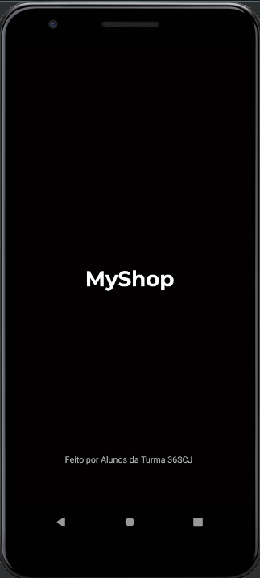

<h1 align="center">Mobile Development</h1>
 

   <a href="#-projeto">Projeto</a>&nbsp;&nbsp;&nbsp;|&nbsp;&nbsp;&nbsp;
   <a href="#tecnologias">Tecnologias</a>&nbsp;&nbsp;&nbsp;&nbsp;&nbsp;&nbsp;
 

   

    
  

 ## 💻 Projeto
 Projeto referente a disciplina de Mobile Development, do MBA da [FIAP](https://www.fiap.com.br/mba/mba-em-full-stack-developer-microservices-cloud-e-iot/). Foi desenvolvido um e-commerce com todas as funções de CRUD para o cadastro de usuários e produtos.
 
 
 ## :rocket: Tecnologias
 - IDE - Android Studio
 - Kotlin
 - Firebase Auth
 - Firebase Storage
 - Firestore

 ---
<h4 align="center">
   Code and coffee ☕
</h4>
